# Welcome To Academix: The Ultimate ERP for Higher-Ed Institutions
## Common User Stories and Problems
**Faculty Evaluation Committee (FEC) Chair**: Dear colleagues, please don't forget to include all required evidence, e.g., student evaluation reports, in your faculty evaluation file. 
**Faculty**: Dear FEC Chair, all student evaluation reports are available on our course management portal. Moreover, to protect information integrity, it would be better if you fetched them directly from there. 
**FEC Chair**: Dear colleague, unfortunately, we don't have access to those reports on the course management portal. And as you know, the faculty evaluation software is different and disconnected from course management.

**Dean**: Dear colleagues, please send your published articles over the current year for the annual activity report. 
**Faculty**: Dear Dean, I have just submitted my faculty evaluation file. Please find them there. 
**Dean**: Yes, but that's a different process and system. Please send that information again.

**Enrollment Services**: Dear Faculty, please verify that the lists of students in your sections are correct. 
**Faculty**: Dear Enrollment Services, how/why could/would a list of students be incorrect? 
**Enrollment Services**: Some recent updates in our Roster Management System may not have been replicated in our Learning Management System.

**Student**: Dear Advisor, I would like to stop by to get my course pre-registration form signed. 
**Advisor**: OK, but did you prepare/update your degree plan? 
**Student**: I have submitted it last semester as an Excel file. It hasn't changed since. 
**Advisor**: I can't find it, please send it again. Also, remind me about the program you're enrolled in and your minor, as well as your overall performance so far.

**VPAA**: Dear colleagues, I am delighted to announce the launching of yet another software, dedicated to Quality Assurance. You will receive instructions explaining how to copy your sections from the LMS to the new Quality Assurance software, as well as how to export some material to include in your course portfolios.

## Opportunity
We can have an endless stream of such stories, let alone accounting, payroll, HR, puchasing, inventory, etc. Do they sound familiar? Does your institution too use a plethora of disconnected software systems, causing information redundancy and inconsistency? And with all these systems, does your institution still have most of its processes paper-based? Are you fed up with this situation?

Do you dream of one ultimate system that replaces them all? A single source of truth where information is never entered twice, while being readily available anytime, anywhere?

Welcome To Academix: The Ultimate, All-in-one ERP for Higher-Ed Institutions!

## Academix Vision
To become the N°1 choice of higher-ed institutions worldwide, for holistic and integrated academic, administrative, and financial management.

## Academix High-level Design Principles
- Single Source of Truth
- Infinite eXpansion
- Best-in-class Coverage
- Ideal User eXperience
  - Extreme automation
  - Zero redundancy

## Academix Unique Strengths
- The Vision
- The Subject-matter Expertise
- The Data Model
- The Technology Stack

## Implemented (Integrated) Applications (the list is growing)
- **Communication & Collaboration**: Visio-conferencing, Chat, Notifications
- **Catalog Management System (CMS)**: Schools, Programs, Disciplines, Courses (description, ILOs, pre/co requisites, textbooks)
- **Planning & Roster Management System (PRMS)**: Calendar, Terms (important dates; add/drop, last day to drop with W, grade submission, etc.), Sections, Resources (buildings, rooms, reservations)
- **Advising**: Advisees, Degree Plans (automatic generation)
- **Learning Management System (LMS)**: Course Creation and Management (modules, chapters, assessments, statistics), Attendance Management, Syllabus Generation (PDF), Communication Channels (visio, chat)
- **Quality Management System (QMS)**: Accreditation Management, ILO/SO Mapping and Tracking, Portfolio Management
- **Document Management System (DMS)**: Folders, Documents, Favorites, Sharing (e.g., with students of a given program or faculty in a given discipline), Workspaces
- **Capstone/Internship Management System (CIMS)**: Project Lifecycle Mangement (proposal, approval, diaries, defense, report, archive)
- **Research Management System (RMS)**: Journal Articles, Conference Papers, Books, Presentations, Activities

## Actors / Security Roles (the list is growing)
- Student
- Faculty
- Registrar
- Coordinator
- Course Manager
- Program Manager
- Internship/Capstone Manager
- Dean
- VPAA
- President
## Screenshots (Academix applied to Al Akhawayn University)
### Communication & Collaboration

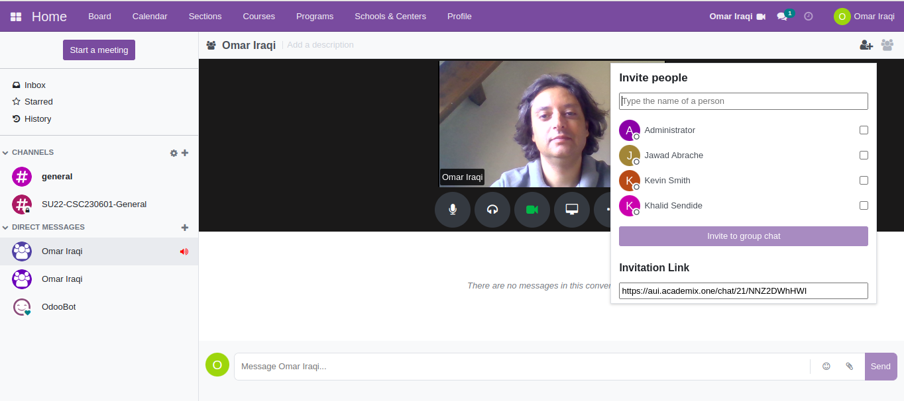 Figure 1. Communication & Collaboration Board

### Catalog Management

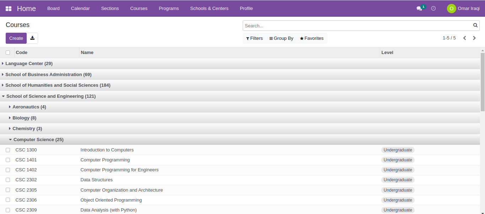 Figure 2. Courses organized by School & Discipline

 Figure 3. Course Information

 Figure 4. Course Search

### Planning & Roster Management

 Figure 5. Calendar

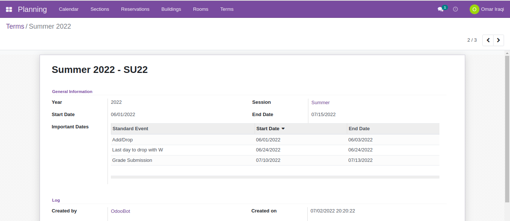 Figure 6. Term & Important Dates/Events

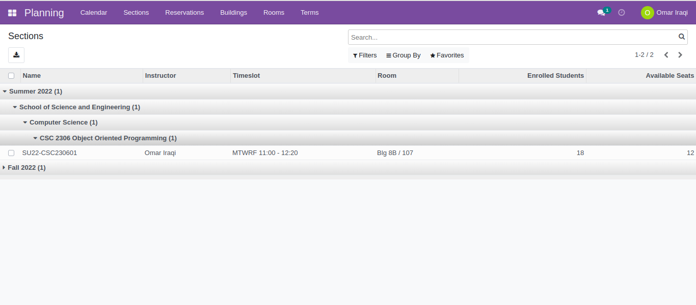 Figure 7. Sections organized by Term, School, Discipline, and Course

 Figure 8. Section Information

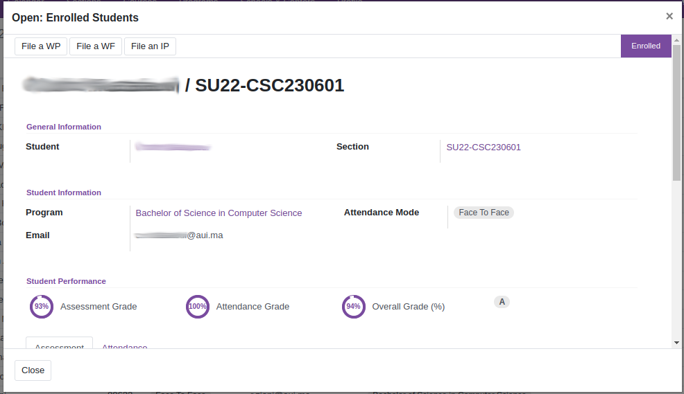 Figure 9. Enrolled Student Management

 Figure 10. Buildings

 Figure 11. Building Information

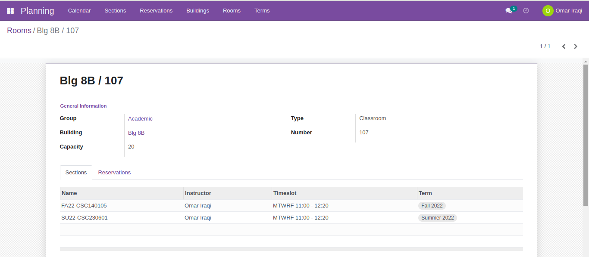 Figure 12. Room Information

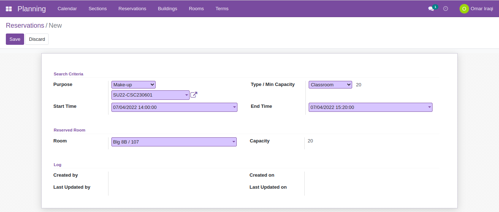 Figure 13. Room Reservation

### LMS

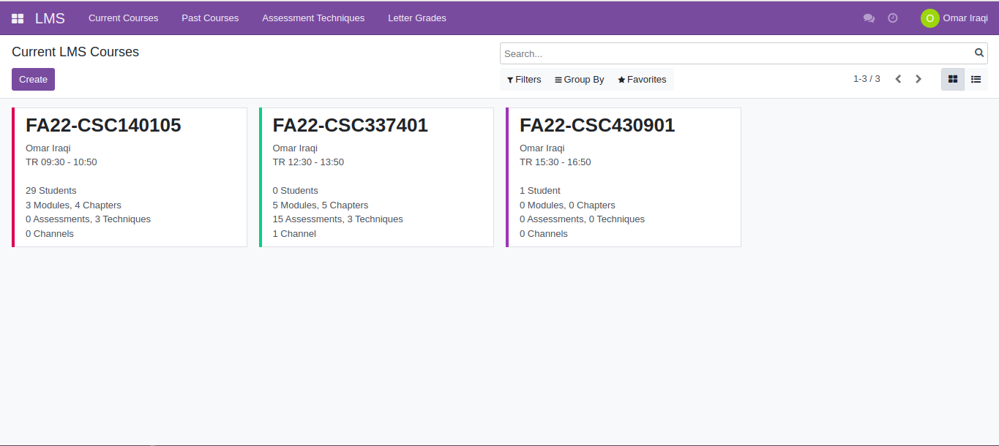 Figure 14. LMS Courses

 Figure 15. LMS Course

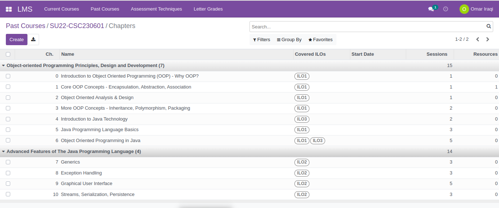 Figure 16. LMS Course Chapters organized by Module

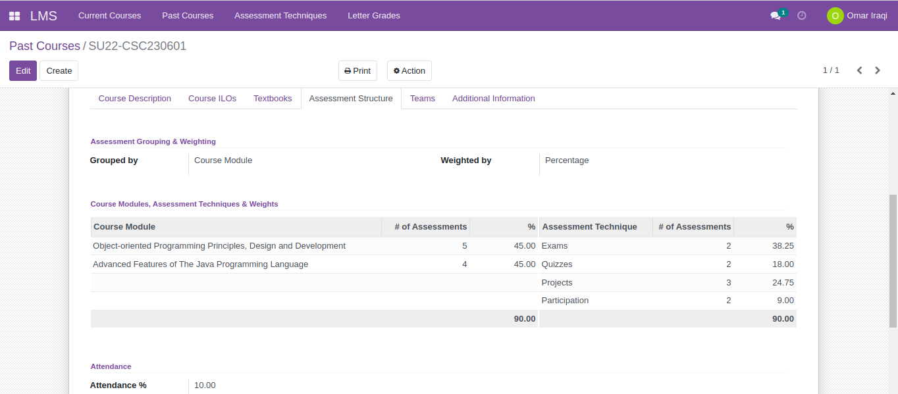 Figure 17. LMS Course Assessment Structure

 Figure 18. LMS Course Textbooks

 Figure 19. Assessments

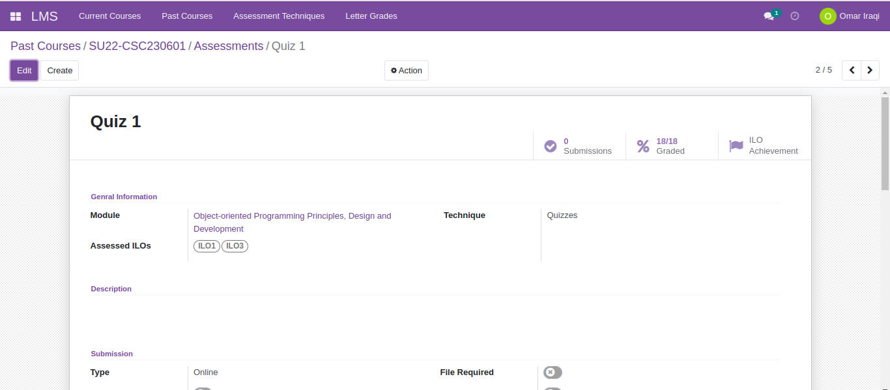 Figure 20. Assessment

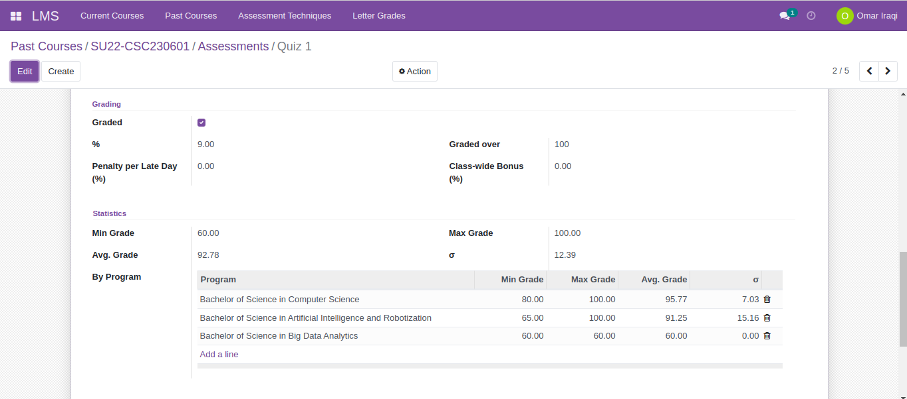 Figure 21. Assessment

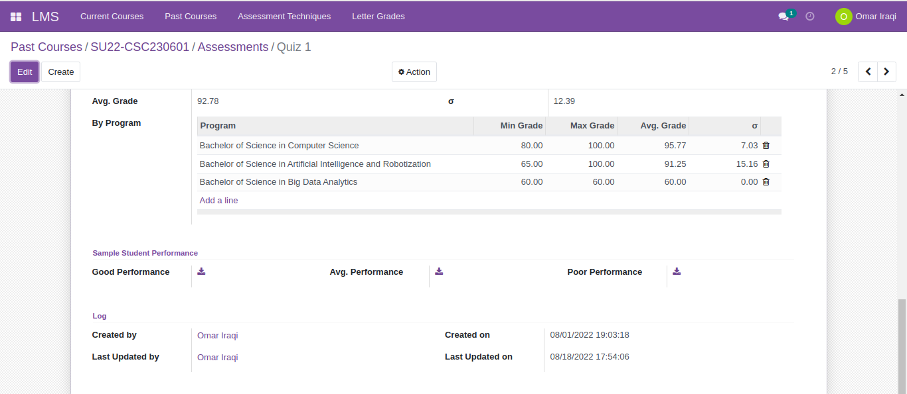 Figure 22. Assessment

 Figure 23. Attendance Sheets

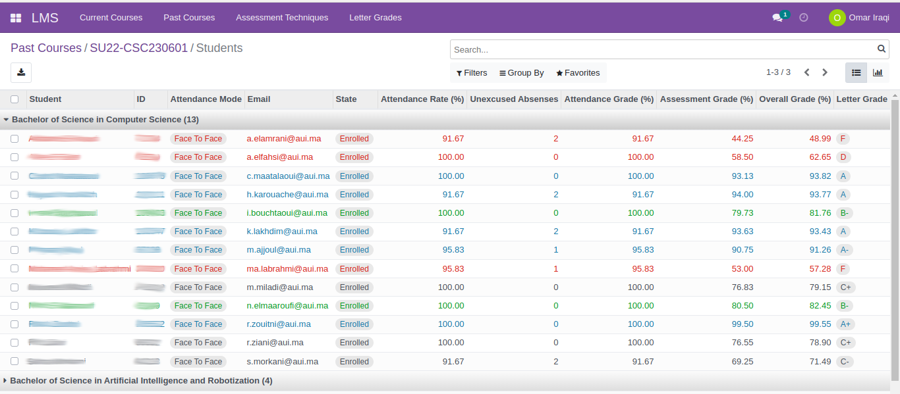 Figure 24. Student Grades organized by Program

### QMS

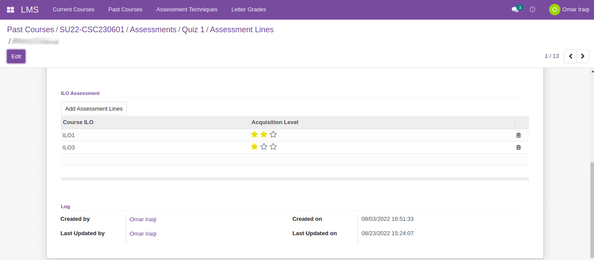 Figure 25. ILO Assessment

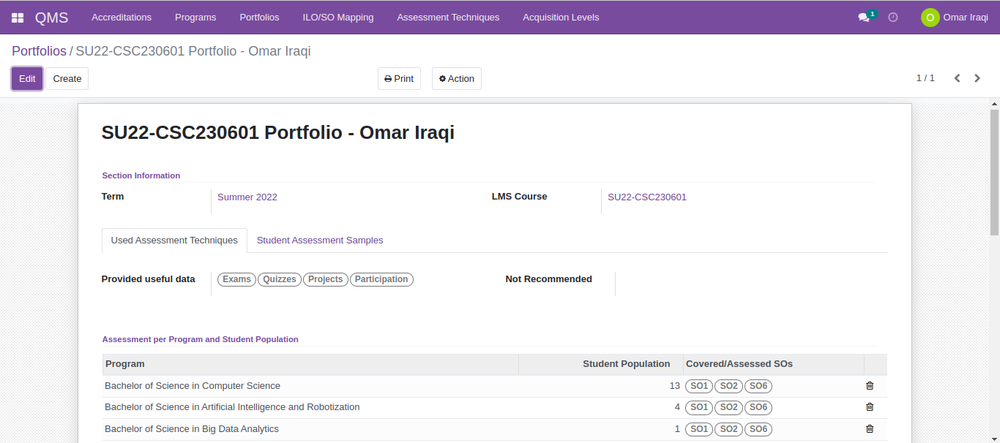 Figure 27. Course Portfolio

 Figure 28. Course Portfolio - Student Assessment Samples

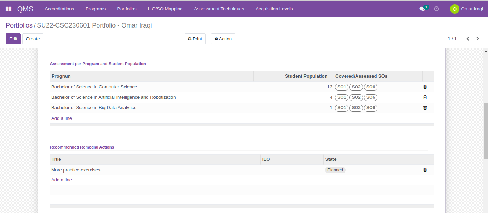 Figure 29. Course Portfolio

 Figure 30. Course Portfolio - ILO Acquisition by Program and Student Population

 Figure 31. Course Portfolio - ILO/SO Mapping

### Document Management System - DMS

 Figure 32. DMS

 Figure 33. DMS

### Research Mangement

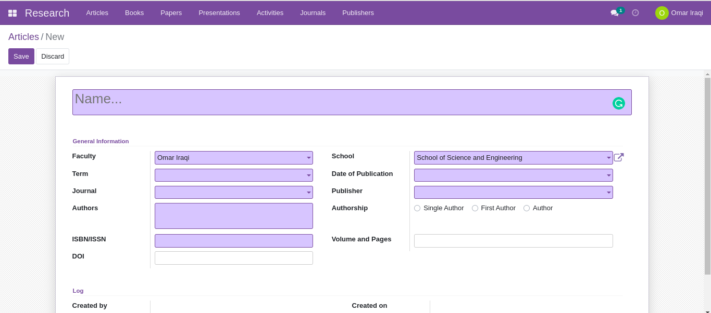 Figure 34. Research - New Journal Article

 Figure 35. Research - New Journal
